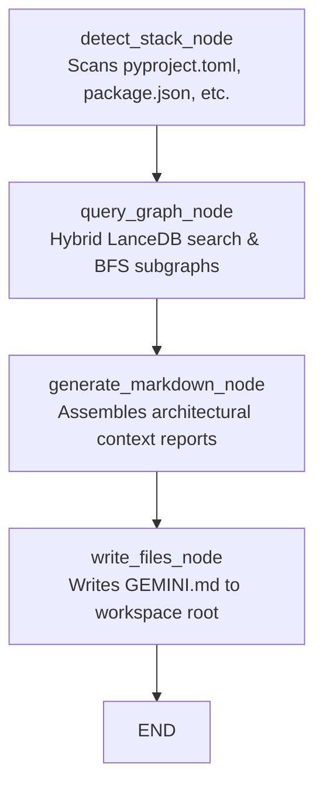

# 🔮 Project Consultant Agent

The **Project Consultant Agent** is a stateful LangGraph agentic pipeline modeled in `backend/consultant_agent.py`. Its primary function is to scan local workspace directory manifests, identify the package/manifest tech stack, retrieve active developer coding rules from our Property Graph, and bootstrap an elegant root-level context file (`GEMINI.md`) for agentic IDEs.

---

## 🛠️ Graph Architecture & Flow

---

## ⚙️ Consultant Node Stages

### 1. `detect_stack_node`
Scans the local directory path manifest recursively to detect technology keys:
*   `package.json` $\rightarrow$ JavaScript dependencies.
*   `pyproject.toml` or `requirements.txt` $\rightarrow$ Python dependencies.
*   `Cargo.toml` $\rightarrow$ Rust dependencies.
Compiles a sorted array of detected stack keys (e.g. `fastapi`, `lancedb`, `numpy`).

### 2. `query_graph_node`
Queries the database facade to find guidelines matching the stack keys:
1.  Performs high-confidence similarity lookups in **LanceDB** (`score > 0.65`) for each key to find relevant seed nodes.
2.  Falls back to a keyword grep in Kuzu description fields if no vector hits are matched.
3.  Executes a **2-hop multi-depth BFS expansion** using openCypher in KuzuDB to collect the neighboring subgraph of related skills, tools, and best practices.
4.  Filters out `deprecated` concepts, returning only active context rules.

### 3. `generate_markdown_node`
Formats the retrieved conceptual network into a beautiful, cohesive context document structured around:
*   **Detected Technology Stack**: manifest summaries.
*   **Active Architectural Principles**: active guidelines extracted from the graph.
*   **Deprecated Patterns**: patterns linked by `SUPERSEDES` pointers, describing obsolete code paradigms to avoid.

### 4. `write_files_node`
1.  Writes the final compiled markdown document to `GEMINI.md` in the target project's root folder.
2.  Saves a local backup of the compiled report under `backend/exports/{project_name}.md` for tracing.
