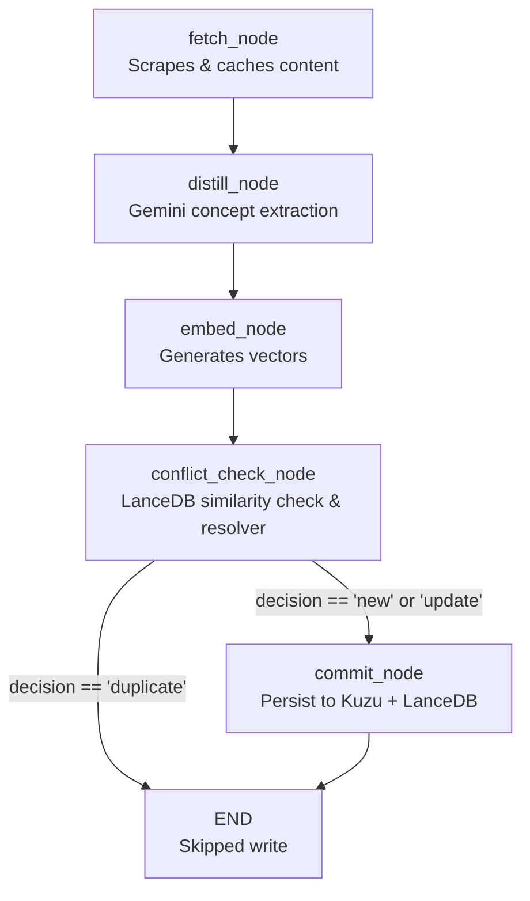

# 📥 Librarian Ingestion Agent

The **Librarian Ingestion Agent** is a stateful LangGraph agentic pipeline modeled in `backend/ingestion_agent.py`. Its primary function is to harvest raw inputs, distill them into highly structured graph nodes and relations, generate embeddings, run conflict resolution, and atomically commit records to our property graph and vector database.

---

## 🛠️ Graph Architecture & Flow

---

## ⚙️ Librarian Node Stages

### 1. `fetch_node`
Scrapes the target URL using `BeautifulSoup4` or reads direct raw text inputs. Computes a unique `source_hash` based on the clean content and saves a backup cache under `backend/cache/{source_hash}.txt` to facilitate reproducible testing.

### 2. `distill_node`
Queries `gemini-2.5-flash` using strict Pydantic schemas (`ExtractedGraph`) to parse text into isolated conceptual nodes (`ExtractedNode`) and relationship connections (`ExtractedEdge`). 

### 3. `embed_node`
Computes a high-dimensional vector representation for each distilled concept using `text-embedding-004` (768 dimensions), or falls back to a deterministic semantic unit mockup if offline.

### 4. `conflict_check_node`
Queries **LanceDB** vector store for semantic matches (similarity threshold > 0.85). If a conflict candidate is found:
*   Passes both concepts to `gemini-2.5-flash` to resolve the conflict.
*   **Duplicate**: The concept already exists. Routes to `END` to skip the duplicate write.
*   **Update**: The new concept contains superior, newer, or more detailed guidelines. Marks target as `update`.
*   **New**: A separate, distinct technical paradigm despite name matches.

### 5. `commit_node`
Executes atomic persistent transactions using the `KnowledgeStore` database facade:
1.  Inserts the new active concept (`KnowledgeNode`) in Kuzu DB and `vectors` table in LanceDB.
2.  If the decision was `"update"`, calls `deprecate_node` on the old concept ID, setting `status = 'deprecated'`, pointing `superseded_by` to the new node, and drawing a physical openCypher **`SUPERSEDES`** connection edge between them.
3.  Inserts relationship edges (`create_relation`), mapping endpoint IDs to their suffix-updated IDs if updates occurred.
