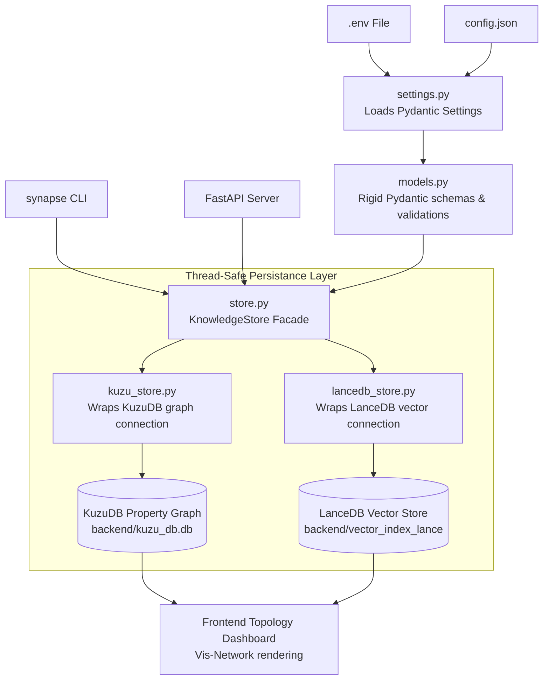

# 🔮 GraphAgentDB Integration & Refinement Plan

This document outlines the strategy for taking the robust, professional, and observable architectural patterns defined in the **"Agentic Brain" Implementation Plan** (`implementation plan.md`) and integrating them directly into the **GraphAgentDB (Agent Knowledge Synapse)** workspace.

---

## 🔍 Comparative Gap Analysis

| Component | "Agentic Brain" Blueprint | GraphAgentDB Current State | Proposed Integration / Refinement |
| :--- | :--- | :--- | :--- |
| **Config & Settings** | Dynamic `.env` + `config.json` loading using `pydantic-settings` to decouple database directories and parameters. | Database files (`kuzu_db.db`, `vector_index_lance`) and constants are hardcoded in python modules. | **Centralized Settings Engine**: Implement `backend/settings.py` loading config dynamically from a central `config.json` file. |
| **Domain Contracts** | Rigid central `models.py` ensuring strong validation (e.g. confidence range `[0, 1]`, non-empty topics, matching vectors). | Dispersed ad-hoc Pydantic schemas in `main.py` and agents, lacking central data contracts or field validations. | **Rigorous Domain Contracts**: Establish a central `backend/models.py` with strict Pydantic rules to enforce clean data schema. |
| **Storage Facade** | A transactional-style `KnowledgeStore` facade wrapping graph and vector stores for atomic, consistent writes. | Queries are made ad-hoc in `backend/database.py` and `backend/vector_store.py` without unified write consistency. | **Atomic Storage Facade**: Create `backend/store.py` implementing `KnowledgeStore` to guarantee graph & vector synchronization. |
| **CLI Observability** | Diagnostics-oriented command-line stubs (like `brain doctor` checking connections and config health). | Typers CLI supports operations (`ingest`, `bootstrap`, `search`) but lacks a diagnostic/troubleshooting tool. | **Diagnostic Command (`synapse doctor`)**: Implement a system-wide environment and database verification tool. |
| **Frontend Controls** | High-fidelity interactive UI displaying tech scanning, rules compiling, and styled graph status hierarchies. | API supports status deprecations, but frontend dashboard lacks the Consultant tab, and Vis-Network node styling is overridden. | **Interactive Glassmorphic Panels**: Complete Phase 5 frontend, add the visual toggle, and correct Vis-Network styling. |

---

## 🛠️ The "Agentic Brain" Infusion (Proposed Architecture)

We will introduce a highly-structured local knowledge architecture designed for production-level reliability:



---

## 📋 What Will Be Taken & Implemented

We will adapt the core components of the blueprint to strengthen GraphAgentDB:

### 1. Centralized Settings & Configuration (`backend/settings.py`)
We will create a structured configuration and settings loader using Pydantic Settings.
* Read a local configuration file `backend/config.json` containing default parameter configurations:
  ```json
  {
    "conflict_similarity_threshold": 0.88,
    "gemini_model": "gemini-2.5-flash",
    "embed_model": "text-embedding-004",
    "embed_dim": 768,
    "kuzu_db_path": "kuzu_db.db",
    "lancedb_path": "vector_index_lance"
  }
  ```
* Support environment variable overrides (e.g. `GEMINI_API_KEY`) loaded from a `.env` file.
* Make directories auto-create when settings are loaded to prevent connection locks.

### 2. Dedicated Data Models with Constraints (`backend/models.py`)
We will establish rigid data structures for concepts, source documents, and agent states, separating schema constraints from raw code:
* **`KnowledgeNode`**:
  * `id`: Unique identifier (string, e.g. slug format validation).
  * `type`: One of `"agent"`, `"skill"`, `"tool"`, `"best_practice"`, `"theoretical_knowledge"`, `"concept"`.
  * `name`: Non-empty name.
  * `description`: Non-empty description.
  * `status`: Active or Deprecated (defaults to `"active"`).
  * `superseded_by`: Optional ID of newer node.
  * `supersession_reason`: Optional reason.
* **`SourceDocument`**:
  * `source_hash`: SHA-256 unique identifier.
  * `title`: Clean page title.
  * `url`: Scrape source.
  * `body`: Raw text context.
* Include Pydantic field validators checking confidence scales, embedding size parameters, and valid relationship type labels.

### 3. Atomic Dual-Store Facade (`backend/store.py`)
To prevent data misalignment (e.g. a node added in Kuzu but failing in LanceDB), we will implement a unified `KnowledgeStore` class:
* **Encapsulated Operations**:
  * `add_node(node: KnowledgeNode, embedding: List[float])`: Atomically saves to Kuzu and inserts into the LanceDB vector index.
  * `deprecate_node(node_id: str, new_node_id: str, reason: str)`: Updates Kuzu (setting status, reason, `superseded_by` pointer), updates LanceDB status to `'deprecated'`, and creates the physical `SUPERSEDES` relationship edge in the graph.
  * `create_relation(source_id: str, target_id: str, rel_type: str, description: str)`: Creates edges while validating endpoint presence.
  * `semantic_search(query: str, top_k: int)`: Executes vectorized query lookups.
  * `stats()`: Returns consolidated record counts across both databases.
* Connects using shared connection caches to ensure thread safety during multi-process lookups.

### 4. Observable System Diagnostics (`synapse doctor`)
We will implement an interactive troubleshooting command in `cli.py`:
* Validate that Python is 3.11+ and crucial manifest folders exist.
* Verify `.env` configuration and Gemini API access capabilities.
* Perform read-write-delete connectivity tests to KuzuDB and LanceDB.
* Generate a clean health-score table directly in the terminal interface using rich formatting.

### 5. High-Fidelity Frontend Complete (Phase 5 Frontend)
To give users a premium interactive workspace experience, we will implement complete UI panels matching our design aesthetic:
* **Interactive Consultant Dashboard Tab**:
  * Place a smooth glass tab switch inside `panel-left` (URL Crawler vs. Raw Text vs. Project Consultant).
  * Design a beautiful, premium configuration form inside the tab: a workspace path text input, a prominent "Bootstrap Context File" action button, and a visual progress indicator.
  * Render the resulting `GEMINI.md` document in a clean, code-highlighted display panel inside the central panel, complete with custom scroll bars and copying capabilities.
* **Visual Topology Legend & Toggles**:
  * Add a prominent action switch inside the Center Topology header card: **"Show Deprecated: Off/On"**.
  * Keep track of the visibility state, dynamically querying the upgraded `/api/graph?show_deprecated=true|false` endpoint and re-projecting the vis-network graph.
* **Perfect Vis-Network Visual Styling**:
  * Fix the Vis-Network node formatting in `frontend/app.js` to preserve the backend-configured colors and low opacity (opacity `0.5`, dark-gray fill `#2d3748`, dashed borders) for deprecated nodes.
  * Correct the edge parser so that `SUPERSEDES` relationships display as high-vibrancy dashed crimson arrows (`#ef4444`) with clean legends.

---

## 🚀 Step-by-Step Implementation Plan

### Milestone 1: Domain Contracts & Configuration System (Foundation)
* **Create** `backend/config.json` containing default paths and configurations.
* **Create** [backend/settings.py](file:///c:/Users/filip/GraphAgentDB/backend/settings.py) loading paths, parameters, and environmental variables.
* **Create** [backend/models.py](file:///c:/Users/filip/GraphAgentDB/backend/models.py) with structured Pydantic representations and field range validations.
* **Update** `backend/database.py` and `backend/vector_store.py` to source paths, configurations, and API keys from the unified `settings` instance rather than hardcoding.

### Milestone 2: Unified Database Facade (Reliability)
* **Create** [backend/store.py](file:///c:/Users/filip/GraphAgentDB/backend/store.py) containing the transactional `KnowledgeStore` facade.
* **Refactor** the Librarian LangGraph state machine (`backend/ingestion_agent.py`) to execute all storage queries, writes, deprecations, and relationship mappings using the clean `KnowledgeStore` methods.
* **Refactor** the Consultant LangGraph state machine (`backend/consultant_agent.py`) and search engine (`backend/hybrid_search.py`) to query using the facade.
* **Verify** existing backend unit tests pass successfully.

### Milestone 3: Observability & Doctor command (Harkening)
* **Update** [cli.py](file:///c:/Users/filip/GraphAgentDB/cli.py) introducing the `doctor` subcommand.
* Implement verification checks: Python runtime environment, database lock checks, Gemini SDK configurations, and mock read-write cycles.
* Output rich, detailed feedback in the console.

### Milestone 4: Frontend Console & Project Consultant Dashboard (Aesthetics)
* **Update** [frontend/index.html](file:///c:/Users/filip/GraphAgentDB/frontend/index.html) to incorporate the Project Consultant UI elements inside a tab selector.
* Add the Bootstrap progress bar and the markdown code renderer.
* Add the **"Show Deprecated"** toggle inside the Topology header card.
* **Update** [frontend/app.js](file:///c:/Users/filip/GraphAgentDB/frontend/app.js):
  * Implement tab switching and POST `/api/consult/bootstrap` endpoint triggers.
  * Append `?show_deprecated=true|false` parameters on `/api/graph` fetches.
  * Style Vis-Network configuration rules to cleanly display deprecated concepts and superseding dashed crimson lines.

---

## 🧪 Verification & E2E Testing Plan

To ensure no features break during integration, we will execute a thorough verification matrix:

### 1. Storage Adaptability Tests
```powershell
# Run the existing unit test suite to verify Kuzu operations remain intact
.venv\Scripts\python -m unittest test_backend.py
```

### 2. End-to-End Ingestion Testing
* Write a new unit test in `tests/test_ingestion_agent.py` validating that:
  * `fetch_node` successfully caches raw text.
  * Ingesting a duplicate URL executes the LangGraph `conflict_check` node and returns early with state `duplicate` without appending records.
  * Ingesting an updated version of a concept correctly updates the original node's status to `deprecated` in both Kuzu and LanceDB and adds a `SUPERSEDES` relationship.

### 3. E2E Developer Bootstrap Testing
```powershell
# Execute a test bootstrap command
.venv\Scripts\python cli.py bootstrap .
```
* Verify a `GEMINI.md` file is generated inside the current directory.
* Verify the generated markdown lists python dependencies (`fastapi`, `kuzu`, `numpy`, etc.) inside the stack section and retrieves relevant guidelines from the DB.
