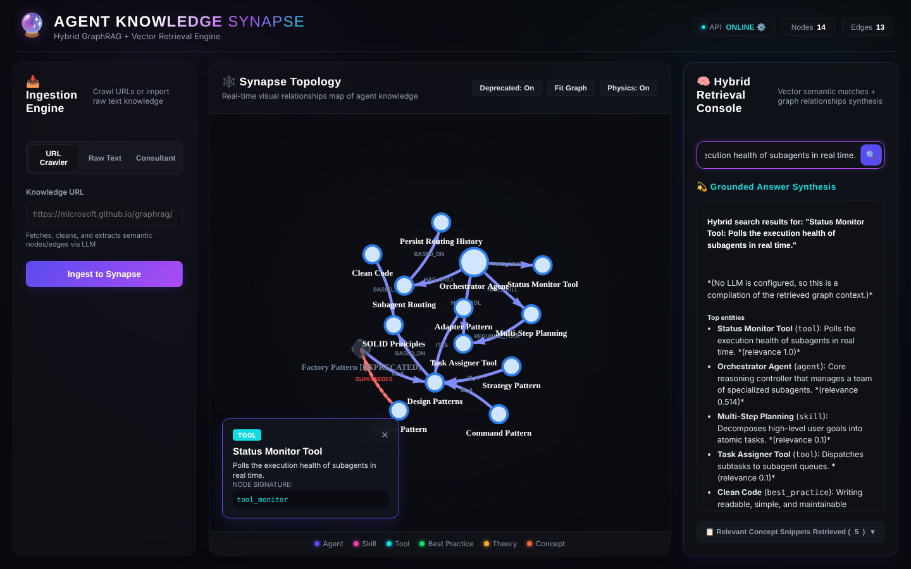
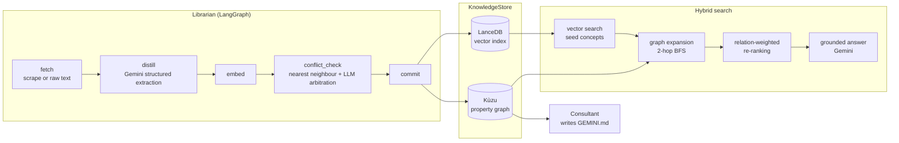

# GraphAgentDB

[](https://github.com/filipe-carmo/GraphAgentDB/actions/workflows/ci.yml)


**A local knowledge base for AI-agent engineering that combines a property graph with a vector index.**

Feed it articles or notes about agents, tools, skills and best practices. An LLM pipeline turns them
into a typed knowledge graph, keeps it free of duplicates, and tracks when newer guidance supersedes
older guidance. Questions are answered with hybrid retrieval: vector search finds the relevant
concepts, graph traversal pulls in what they connect to, and the answer is grounded in both.



## Highlights

- **Hybrid retrieval.** LanceDB similarity search seeds the query; a breadth-first walk over the
  Kùzu graph adds neighbouring agents, skills and tools; relation-aware score propagation re-ranks
  the result (an agent that `HAS_TOOL` a matching tool is boosted, and so on).
- **Agentic ingestion with conflict resolution.** A LangGraph workflow (the *Librarian*) scrapes a
  URL or takes raw text, extracts typed nodes and edges with Gemini structured output, and compares
  each new concept with its nearest neighbour. Near-matches are arbitrated by the LLM as
  `duplicate` (skipped), `update` (old node deprecated, linked with a `SUPERSEDES` edge) or `new`.
- **Knowledge versioning.** Deprecated concepts stay in the graph for provenance but drop out of
  vector search, so answers only use current guidance.
- **Project bootstrap.** A second workflow (the *Consultant*) reads a project's `package.json`,
  `pyproject.toml`, `requirements.txt` or `Cargo.toml` and writes a context file (`GEMINI.md` by
  default) with the practices that apply to that stack and the patterns to avoid.
- **Runs offline.** Without an API key every LLM step has a deterministic fallback, so the whole
  pipeline, the UI and the test suite work with no network access.
- **Three interfaces.** A FastAPI service, a Typer CLI and a vis-network web UI.

## Architecture



The graph schema has six node types (`agent`, `skill`, `tool`, `best_practice`,
`theoretical_knowledge`, `concept`) and eight relation types (`HAS_SKILL`, `HAS_TOOL`,
`REQUIRES_TOOL`, `BASED_ON`, `REFERENCES`, `MENTIONS`, `IS_A`, `SUPERSEDES`).

| Module | Responsibility |
| --- | --- |
| `graphagentdb/graph_store.py` | Kùzu schema, parameterised Cypher upserts, subgraph BFS |
| `graphagentdb/vector_store.py` | LanceDB table, cosine search over active vectors |
| `graphagentdb/store.py` | `KnowledgeStore` facade that keeps graph and vectors in sync |
| `graphagentdb/llm.py` | Gemini generation and embeddings, offline fallbacks, optional local agent harness |
| `graphagentdb/extractor.py` | Web scraping and LLM extraction into a typed graph |
| `graphagentdb/ingestion.py` | The Librarian ingestion workflow |
| `graphagentdb/search.py` | Hybrid retrieval and answer synthesis |
| `graphagentdb/consultant.py` | The Consultant bootstrap workflow |
| `graphagentdb/api.py` / `cli.py` | FastAPI app (also serves the UI) and Typer CLI |

## Getting started

Requires Python 3.11+.

```bash
git clone https://github.com/filipe-carmo/GraphAgentDB.git
cd GraphAgentDB
python -m venv .venv && source .venv/bin/activate   # Windows: .venv\Scripts\activate
pip install -e ".[dev]"

cp .env.example .env          # optional: add GEMINI_API_KEY for real extraction and embeddings
python examples/seed_demo.py  # optional: load a small demo graph
graphagentdb serve            # API + UI on http://127.0.0.1:8000, docs at /docs
```

### CLI

```bash
graphagentdb ingest --url https://microsoft.github.io/graphrag/
graphagentdb ingest --text "The ReAct pattern interleaves reasoning and tool calls..."
graphagentdb search "Which tools does the orchestrator agent rely on?"
graphagentdb bootstrap path/to/your/project
graphagentdb stats
graphagentdb doctor
```

### API

| Method | Path | Purpose |
| --- | --- | --- |
| `GET` | `/api/status` | Health check and node, edge and vector counts |
| `POST` | `/api/ingest` | `{"url": ...}` or `{"text": ...}` |
| `POST` | `/api/search` | `{"query": ..., "top_k": 5}` |
| `GET` | `/api/graph?show_deprecated=true` | Whole graph in vis-network format |
| `POST` | `/api/consult/bootstrap` | `{"project_path": ...}` |

The bootstrap endpoint writes files on the server, so the service is meant for local use and binds
to `127.0.0.1` by default.

## Configuration

Settings come from environment variables or a `.env` file (see [`.env.example`](.env.example)).

| Variable | Default | Notes |
| --- | --- | --- |
| `GEMINI_API_KEY` | unset | Without it, GraphAgentDB runs in offline mode |
| `GRAPHAGENTDB_DATA_DIR` | `data` | Where the graph, vectors, cache and exports live |
| `GRAPHAGENTDB_GEMINI_MODEL` | `gemini-2.5-flash` | Extraction, arbitration and answers |
| `GRAPHAGENTDB_EMBED_MODEL` | `gemini-embedding-001` | Requested at `GRAPHAGENTDB_EMBED_DIM` (768) dimensions |
| `GRAPHAGENTDB_CONFLICT_SIMILARITY_THRESHOLD` | `0.85` | Similarity above which a new concept is checked for conflicts |
| `GRAPHAGENTDB_CONTEXT_FILENAME` | `GEMINI.md` | File written by `bootstrap` (for example `AGENTS.md`) |
| `GRAPHAGENTDB_USE_AGENT_HARNESS` | `false` | Route prompts through a local `agentapi` CLI before Gemini |

**Offline mode** uses keyword-based extraction, deterministic pseudo-embeddings and a compiled
Markdown answer. It exists for development and tests: pseudo-embeddings only match identical text,
so real semantic search needs an API key.

## Development

```bash
pytest          # 35 tests, fully offline
ruff check .
ruff format .
```

CI runs lint, format check and tests on Python 3.11 and 3.13.

## Tech stack

Python · FastAPI · LangGraph · Kùzu · LanceDB · PyArrow · Google Gemini (`google-genai`) ·
Pydantic · Typer · Rich · BeautifulSoup · vis-network

## License

[MIT](LICENSE)
